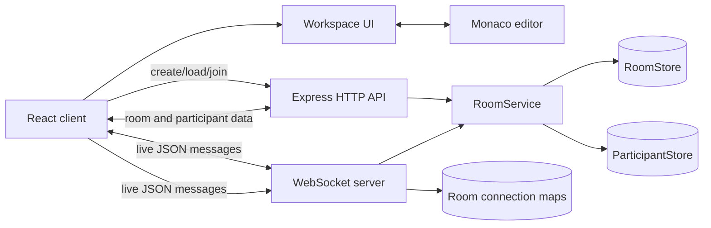
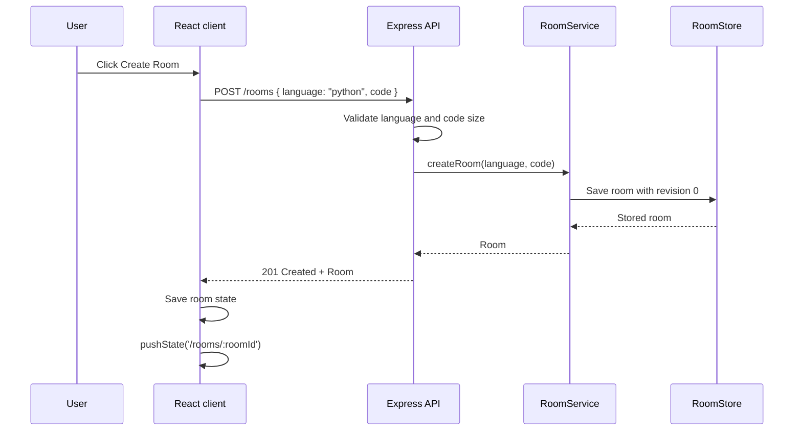
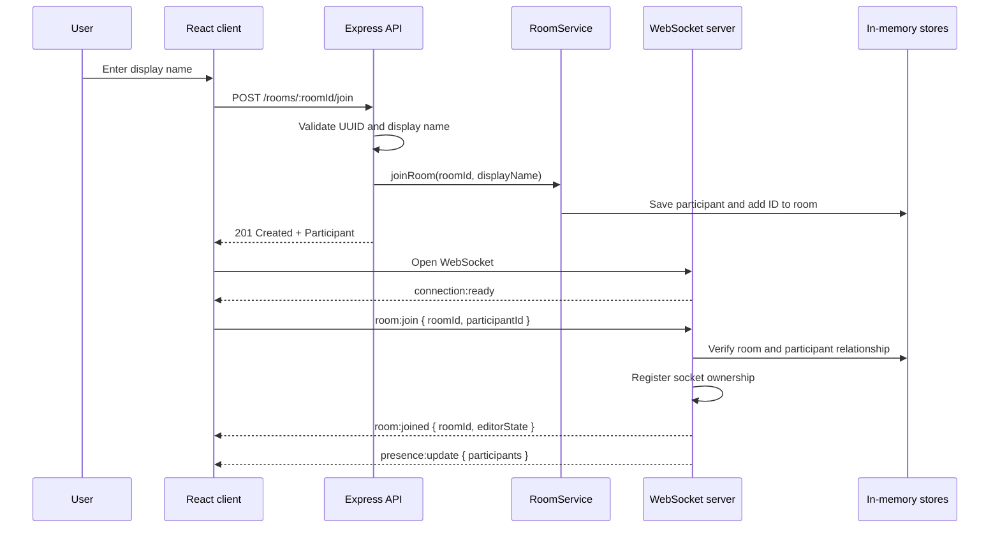
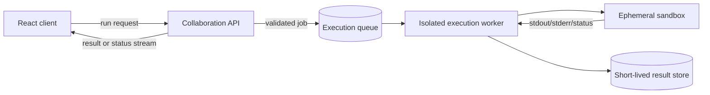

# Code Together

Code Together is a browser-based collaborative code editor. A user can write code locally, create a shareable room, join that room under a display name, and collaborate with other connected participants in real time.

The current frontend is intentionally Python-only: Monaco always uses Python mode, rooms created by this client are marked as Python, and no language selector is shown. The platform synchronizes source code and participant presence, but it does **not** compile or execute code yet.

## Current capabilities

- Monaco-based Python editor with a `main.py` workspace
- Room creation with a shareable `/rooms/:roomId` URL
- One-click copying of the full room URL
- Room loading through the HTTP API
- Temporary participant identities scoped to a room session
- Real-time source-code synchronization over WebSockets
- Live participant presence and disconnect updates
- Server-authoritative editor state with monotonically increasing revisions
- Runtime validation for HTTP requests and WebSocket messages
- Configurable client API/WebSocket URLs and server origin/port

## Technology stack

| Layer | Technology | Responsibility |
| --- | --- | --- |
| Web client | React, TypeScript, Vite | Workspace UI, local editor state, room controls, and network clients |
| Editor | Monaco Editor through `@monaco-editor/react` | Python editing experience and syntax highlighting |
| HTTP API | Express | Health checks, room creation/loading, and participant creation |
| Real-time transport | `ws` WebSocket server | Room attachment, editor updates, and presence |
| Application runtime | Node.js | Hosts Express and WebSockets on one HTTP server |
| Storage | In-memory `Map` instances | Stores rooms and participants for the lifetime of the server process |

## Repository layout

```text
code-together/
├── app/
│   ├── client/
│   │   ├── src/
│   │   │   ├── api/rooms.ts              # HTTP room client and shared response shapes
│   │   │   ├── components/
│   │   │   │   ├── CodeEditor.tsx        # Monaco adapter
│   │   │   │   ├── CopyRoomLinkButton.tsx # Share-link interaction and feedback
│   │   │   │   └── ParticipantList.tsx   # Presence UI
│   │   │   ├── config/editor.ts          # Central Python editor configuration
│   │   │   ├── services/clipboard.ts      # Browser clipboard adapter
│   │   │   ├── App.tsx                   # Client state and orchestration
│   │   │   └── App.css                   # Workspace styling
│   │   └── package.json
│   └── server/
│       ├── src/
│       │   ├── domain/                    # Room and participant types
│       │   ├── services/roomService.ts    # Room business operations
│       │   ├── store/                     # In-memory persistence adapters
│       │   └── index.ts                   # HTTP routes and WebSocket protocol
│       ├── package.json
│       └── tsconfig.json
├── .gitignore
└── README.md
```

## Architecture

The platform uses one browser client and one Node.js server. The server exposes two communication paths on the same port:

1. **HTTP is the control plane.** It creates rooms, retrieves room state, and issues participant identities.
2. **WebSockets are the collaboration plane.** They attach an issued participant to a live room and carry code and presence events used by the current frontend.



### Client architecture

`App.tsx` is currently the client-side orchestration boundary. It owns:

- the current source code;
- the loaded room ID;
- the temporary participant ID and display name;
- the participant presence list;
- the WebSocket lifecycle and connection status;
- room creation, room loading, and join actions.

The smaller UI components are intentionally presentation-focused:

- `CodeEditor` adapts Monaco's `onChange` callback and read-only setting.
- `CopyRoomLinkButton` owns clipboard interaction status and user feedback.
- `ParticipantList` renders the server-provided presence list.
- `api/rooms.ts` isolates HTTP calls from the UI.

Python editor metadata lives in `config/editor.ts`. Both Monaco configuration and room creation depend on that single immutable value, preventing scattered language literals without introducing a language-selection abstraction the UI does not need.

The client performs runtime checks on incoming WebSocket messages before applying them. These checks prevent malformed data from being treated as trusted application state, although they are not a substitute for authentication or a shared schema package.

### Server architecture

The server is divided into four responsibilities:

- **Transport:** Express routes and the WebSocket event handler parse external input and return protocol-level responses.
- **Validation:** Route and socket helpers validate UUIDs, supported languages, display names, and code sizes.
- **Business logic:** `RoomService` creates rooms and participants and updates room state.
- **Storage:** `RoomStore` and `ParticipantStore` wrap in-memory maps.

Express and the WebSocket server share a single Node HTTP server. This keeps deployment simple and allows HTTP and WebSocket traffic to use the same port, while retaining distinct protocols and handlers.

### Server-side state

The server maintains four related collections:

| Collection | Key | Value | Purpose |
| --- | --- | --- | --- |
| `RoomStore` | Room UUID | `Room` | Canonical editor state and participant references |
| `ParticipantStore` | Participant UUID | `Participant` | Temporary participant profile |
| `roomConnections` | Room UUID | Set of WebSocket connections | Live sockets currently attached to each room |
| `socketParticipants` | WebSocket connection | Room and participant IDs | Ownership of each authenticated room connection |

The stores are process-local. Restarting the server deletes every room, participant, revision, and connection record.

## Domain model

### Room

```ts
interface Room {
  id: string;
  editorState: {
    code: string;
    language: "typescript" | "javascript" | "python";
    revision: number;
  };
  participantIds: string[];
  createdAt: number;
}
```

`editorState` is the server's canonical representation of a room's document. `revision` starts at `0` and increments for every accepted code or language update. The backend retains its general language field for compatibility and possible future expansion, while the current frontend always presents the document as Python.

### Participant

```ts
interface Participant {
  id: string;
  displayName: string;
  joinedAt: number;
}
```

Participant IDs are temporary UUIDs. There are no user accounts, passwords, cookies, or durable sessions in the current architecture.

## End-to-end data flow

### 1. Local editing and room creation

Before a room exists, Monaco edits only local React state. Language changes are also local.

When the user selects **Create Room**:



The current editor contents are included in room creation. Creating a room does not automatically create or connect a participant; the user must still join the room.

### 2. Opening a shared room URL

When the application loads a URL matching `/rooms/:roomId`:

1. The client extracts the room ID from `window.location.pathname`.
2. It requests `GET /rooms/:roomId`.
3. The server validates the UUID and reads the room from `RoomStore`.
4. The client replaces its local code with the returned canonical state.
5. The room editor remains read-only until the user joins and the WebSocket attachment succeeds.

Production hosting must route unknown client paths such as `/rooms/:roomId` back to the Vite application's `index.html`; otherwise a direct browser refresh can return a hosting-layer 404 before React loads.

### 3. Joining and attaching a WebSocket

Joining uses both transports. HTTP first creates the participant identity; WebSocket then proves that identity belongs to the requested room and attaches the live connection.



The `room:joined` message includes the current editor state. This second synchronization point prevents the joining browser from keeping stale state if another collaborator edited the room between the initial HTTP load and the WebSocket attachment.

Only one active WebSocket may use a participant ID at a time, and one WebSocket may join only one room.

### 4. Source-code synchronization

Code editing is optimistic for the sender:

1. Monaco reports a new full-document string.
2. The sender immediately updates local React state.
3. If its socket is open and attached, it sends `code:update` with the full source string.
4. The server validates the value and its UTF-8 byte size.
5. `RoomService` replaces the room's canonical code and increments the revision.
6. The server broadcasts the accepted code and revision to every other socket in the room.
7. Other clients replace their Monaco value with the received code.

```mermaid
sequenceDiagram
    participant A as Client A
    participant W as WebSocket server
    participant S as RoomService
    participant R as RoomStore
    participant B as Client B

    A->>A: Apply edit locally
    A->>W: code:update { code }
    W->>W: Validate membership and size
    W->>S: updateCode(roomId, code)
    S->>R: Replace code; revision += 1
    S-->>W: Updated room
    W-->>B: code:update { code, revision }
    B->>B: Replace local editor value
```

The server excludes the sender from the code broadcast because the sender has already applied the edit locally.

### 5. Python-only frontend policy

The frontend does not maintain language state, render a language selector, send `language:update`, or apply incoming language changes. `config/editor.ts` fixes Monaco to Python mode and supplies the `PY`, `main.py`, and `Python` labels. Room creation sends the same centralized `"python"` value explicitly.

The backend intentionally retains its broader `ProgrammingLanguage` type, language validation, room field, and `language:update` protocol. This keeps existing server contracts compatible and makes future language reintroduction possible without a backend rewrite. An older room with different language metadata still loads in the current client, but its code is displayed in Python mode.

### 6. Presence and disconnects

Presence is based on active WebSocket attachments rather than every participant record created over HTTP.

When a socket joins or disconnects, the server:

1. gathers participant IDs belonging to currently attached sockets;
2. resolves those IDs through `ParticipantStore`;
3. broadcasts `presence:update` to the room;
4. on disconnect, removes the socket, participant reference, and participant record;
5. removes an empty room connection set when the final socket leaves.

Rooms themselves are not deleted when empty. A room remains available until the server process restarts.

If the HTTP join succeeds but the WebSocket never attaches, that participant record is not displayed in presence. It currently remains in memory because disconnect cleanup only runs for an attached socket.

## HTTP API

The default API base URL is `http://localhost:3000`.

| Method | Path | Request body | Success | Common errors |
| --- | --- | --- | --- | --- |
| `GET` | `/health` | None | `200 { "status": "ok" }` | — |
| `POST` | `/rooms` | `{ "language"?: string, "code"?: string }` | `201 Room` | `400` unsupported language or invalid/oversized code |
| `GET` | `/rooms/:roomId` | None | `200 Room` | `400` invalid UUID, `404` room missing |
| `POST` | `/rooms/:roomId/join` | `{ "displayName": string }` | `201 Participant` | `400` invalid UUID/name, `404` room missing |

### Example: create a room

```bash
curl -X POST http://localhost:3000/rooms \
  -H 'Content-Type: application/json' \
  -d '{"language":"python","code":"answer = 42"}'
```

### Example: join a room

```bash
curl -X POST http://localhost:3000/rooms/ROOM_UUID/join \
  -H 'Content-Type: application/json' \
  -d '{"displayName":"Ada"}'
```

## WebSocket protocol

The default WebSocket URL is `ws://localhost:3000`. Every message is a JSON object with a string `type` field.

### Client-to-server messages

| Type | Payload | Requirement |
| --- | --- | --- |
| `room:join` | `{ roomId, participantId }` | IDs must be valid, related UUIDs issued through HTTP |
| `code:update` | `{ code }` | Socket must have joined; code must be at most 20 KiB |
| `language:update` | `{ language }` | Backend compatibility capability; the Python-only frontend does not send it |

### Server-to-client messages

| Type | Payload | Meaning |
| --- | --- | --- |
| `connection:ready` | No additional fields | Transport connection is open; room is not joined yet |
| `room:joined` | `{ roomId, editorState }` | Room attachment succeeded and canonical state is supplied |
| `code:update` | `{ code, revision }` | Another participant changed the document |
| `language:update` | `{ language, revision }` | Backend compatibility event; the Python-only frontend ignores it |
| `presence:update` | `{ participants }` | Complete list of currently connected participants |
| `room:error` | `{ error }` | The server rejected or could not parse a message |

## Consistency and conflict behavior

The current synchronization model sends the entire document for every change and uses server arrival order:

- The last update processed by the server becomes canonical.
- Each accepted code or language update increments one shared room revision.
- WebSockets preserve message order per connection.
- The client accepts revisions from the server but does not yet use them to reject stale events or request missing state.
- There is no operational transformation, CRDT, text patching, cursor sharing, or selection sharing.

This model is deliberately simple and suitable for the current MVP. Concurrent edits to different parts of a document can overwrite one another because each message contains the entire document.

## Validation and operational limits

| Limit | Current value |
| --- | --- |
| Frontend editor language | Python |
| Backend language metadata | TypeScript, JavaScript, Python retained for compatibility |
| Source code | 20 KiB UTF-8 per room/update |
| Express JSON body | 32 KiB |
| WebSocket payload | 64 KiB |
| Display name | 1–40 trimmed characters |
| Room and participant IDs | UUID format |
| Allowed browser origin | One configured `CLIENT_ORIGIN` |

## Local development

### Prerequisites

- Node.js and npm
- Two terminal sessions

### Install dependencies

```bash
cd app/server
npm install

cd ../client
npm install
```

### Start the server

```bash
cd app/server
npm run dev
```

The server listens on `http://localhost:3000` by default.

### Start the client

```bash
cd app/client
npm run dev
```

Vite serves the client at `http://localhost:5173` by default.

### Try a collaboration session

1. Open `http://localhost:5173`.
2. Edit the starter source if desired.
3. Create a Python room.
4. Join with a display name.
5. Use **Copy Room Link** and open the copied URL in another browser window.
6. Join as a second participant and edit from either window.

## Configuration

### Client build-time variables

| Variable | Default | Purpose |
| --- | --- | --- |
| `VITE_API_URL` | `http://localhost:3000` | Base URL for Express requests |
| `VITE_WS_URL` | `ws://localhost:3000` | WebSocket endpoint |

Example:

```bash
VITE_API_URL=https://api.example.com \
VITE_WS_URL=wss://api.example.com \
npm run build
```

### Server runtime variables

| Variable | Default | Purpose |
| --- | --- | --- |
| `PORT` | `3000` | Shared HTTP and WebSocket port |
| `CLIENT_ORIGIN` | `http://localhost:5173` | Browser origin accepted by CORS |

Example:

```bash
PORT=8080 CLIENT_ORIGIN=https://app.example.com npm start
```

For a production HTTPS client, use `https://` for `VITE_API_URL` and `wss://` for `VITE_WS_URL` to avoid mixed-content browser failures.

## Build and verification

```bash
cd app/client
npm run lint
npm run build

cd ../server
npm run build
npm start
```

The client currently has no automated test command. The server's placeholder `npm test` script intentionally exits with an error because a test suite has not been added yet.

## Current limitations

- Rooms and participants disappear whenever the server restarts.
- A single server process owns all rooms; there is no shared datastore or horizontal scaling strategy.
- There is no authentication, authorization, room password, or ownership model.
- Anyone with a valid room URL can request a participant identity and join.
- There is no rate limiting or abuse protection.
- Reconnection is not automatic, and participant identity is not persisted across reloads.
- Full-document last-write-wins updates can lose concurrent edits.
- The UI uses browser prompts and alerts for join and error flows.
- The client and server duplicate protocol/domain types rather than importing a shared schema.
- Rooms are not expired or garbage-collected.
- The frontend supports Python editing only; code is synchronized but not compiled or executed.

## Future compiler and execution architecture

Compilation and code execution should be added as a separate subsystem rather than running untrusted user programs inside the collaboration API process.

A safe high-level design is:



Recommended compiler milestones:

1. Define an execution request/response contract with language, source, stdin, status, stdout, stderr, exit code, and timing.
2. Start with one language and a local development-only execution adapter.
3. Move execution into an isolated worker with strict CPU, memory, process, filesystem, output, and wall-clock limits.
4. Add a queue so execution cannot block HTTP or WebSocket collaboration traffic.
5. Stream status and output back through a dedicated protocol rather than mixing execution state into editor revisions.
6. Add cancellation, per-user/per-room rate limits, audit logs, and retention limits.
7. Add compiler/runtime image versioning so results remain reproducible.
8. Expand the language registry so editor metadata and execution capability are related but remain distinct.

Before accepting public execution traffic, the platform will need sandboxing that prevents network access, host filesystem access, process escape, fork bombs, excessive output, and resource exhaustion. A timeout alone is not a sufficient security boundary.

## Suggested next architecture improvements

Before or alongside compiler work, the platform would benefit from:

- automated unit tests for `RoomService` and validation helpers;
- HTTP and WebSocket integration tests;
- a shared package for domain types and runtime schemas;
- persistent room storage with explicit expiration;
- reconnect tokens or durable participant sessions;
- structured error payloads with stable error codes;
- patch-based or CRDT synchronization for conflict-safe editing;
- observability for connection counts, room counts, message failures, and latency;
- a deployment configuration with TLS termination and WebSocket upgrade support.

## Design summary

Code Together currently treats the Node server as the source of truth for room state and uses React as a responsive projection of that state. HTTP establishes resources and identities; WebSockets attach live sessions and distribute accepted changes. This separation keeps the MVP understandable while leaving clear boundaries for persistence, stronger collaboration algorithms, authentication, and a future isolated compiler service.
