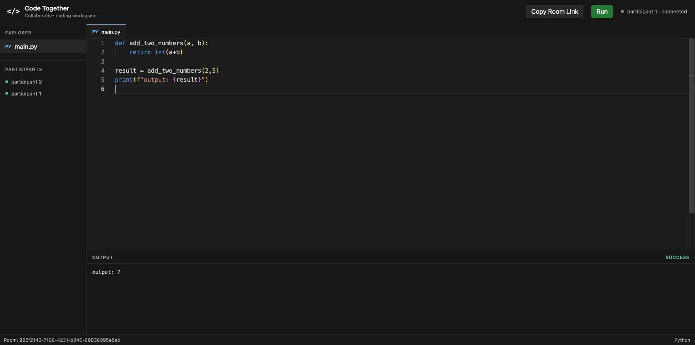
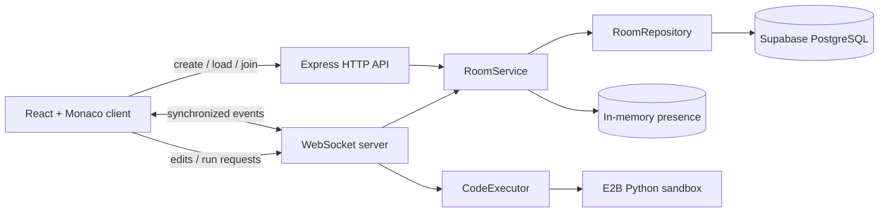
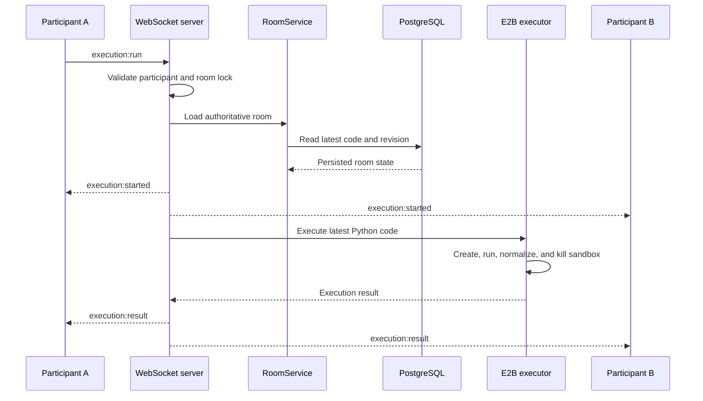

# Code Together

<div align="center">
  <p><strong>A real-time collaborative Python editor with persistent rooms and remote code execution.</strong></p>
  <p>React · TypeScript · Node.js · WebSockets · PostgreSQL · Supabase · E2B</p>
</div>

<p align="center">
  <a href="docs/assets/code-together-demo.mp4">
    
  </a>
</p>

<p align="center">
  <a href="docs/assets/code-together-demo.mp4"><strong>▶ Watch the demo</strong></a>
</p>

## Overview

Code Together is a browser-based workspace where multiple participants can join the same room, edit Python together, and run the latest synchronized code in a remote E2B sandbox.

Room documents are stored in Supabase PostgreSQL, so the room URL, code, and revision survive a complete backend restart. WebSocket connections and participant presence remain in memory because they represent active network sessions rather than durable application data.

## Features

- Create a Python room from the current editor contents
- Join through a shareable `/rooms/:roomId` URL
- Load an existing room directly from its URL
- Synchronize full-document edits over WebSockets
- Display currently connected participants
- Persist room code and revisions in PostgreSQL
- Restore the latest room state after a backend restart
- Run Python remotely in a short-lived E2B sandbox
- Synchronize running, success, error, and timeout states across the room
- Reject simultaneous executions within the same room
- Protect the backend with source, output, payload, and execution-time limits

## Architecture



The backend exposes HTTP and WebSockets through one Node.js server:

- **HTTP** creates rooms, loads persisted state, and issues temporary participant identities.
- **WebSockets** attach participants to rooms and synchronize editing, presence, and execution events.
- **PostgreSQL** is the source of truth for room documents.
- **In-memory maps** hold live sockets, participant presence, and execution locks.
- **E2B** executes untrusted Python outside the Node.js process.

## Core flows

### Collaborative editing

1. Monaco updates the sender's local React state immediately.
2. The client sends `code:update` with the full document and expected revision.
3. The backend validates the socket, participant, payload size, and revision.
4. PostgreSQL atomically updates the row only when the expected revision matches.
5. The backend broadcasts the update only after persistence succeeds.
6. Every connected client applies the same accepted code and revision.

The sender keeps at most one update in flight and queues its newest local document while waiting for acknowledgement. This keeps the synchronization model small and predictable without introducing a CRDT or operational transformation layer.

### Remote Python execution



The browser sends only room and participant IDs in `execution:run`. It never sends source code with the execution request. The backend reloads the authoritative code through `RoomService`, runs it remotely, normalizes provider-specific output, and broadcasts one shared result.

This is Python **execution**, not compilation: a Python interpreter runs the source inside E2B. The backend never uses Node.js `eval`, `exec`, `spawn`, or a local Python process.

### Restart recovery

When the backend stops, all live sockets and temporary participant records disappear. The room row remains in PostgreSQL. Opening the same URL after restart loads the saved code and revision; participants then join again and collaboration continues from that restored state.

## Technology stack

| Layer | Technology | Responsibility |
| --- | --- | --- |
| Frontend | React, TypeScript, Vite | Workspace UI and client state |
| Editor | Monaco Editor | Python editing and syntax highlighting |
| HTTP API | Express | Room creation, loading, and joining |
| Real-time transport | `ws` | Editing, presence, and execution events |
| Backend runtime | Node.js, TypeScript | Application and protocol orchestration |
| Persistence | Supabase PostgreSQL, `pg` | Durable room code and revision state |
| Remote execution | E2B Code Interpreter | Isolated Python execution |
| Tests | Node.js test runner | Focused service, repository, and execution tests |

## Project structure

```text
code-together/
├── app/
│   ├── client/
│   │   ├── src/
│   │   │   ├── api/                 # HTTP room client
│   │   │   ├── components/          # Monaco, presence, sharing, and output UI
│   │   │   ├── config/              # Python editor configuration
│   │   │   ├── services/            # Browser adapters
│   │   │   ├── types/               # Client execution types
│   │   │   └── App.tsx              # Client orchestration and WebSocket lifecycle
│   │   └── package.json
│   └── server/
│       ├── src/
│       │   ├── config/               # PostgreSQL pool and E2B configuration
│       │   ├── domain/               # Room and execution types
│       │   ├── execution/            # Executor contract, E2B adapter, mock, limits
│       │   ├── repositories/         # Room contract and PostgreSQL implementation
│       │   ├── services/             # Room business rules
│       │   ├── store/                # Ephemeral participant state
│       │   └── index.ts              # HTTP, WebSockets, and dependency composition
│       ├── test/
│       └── package.json
├── docs/assets/                       # README screenshot and demo video
├── supabase/migrations/               # Version-controlled database schema
└── README.md
```

## Getting started

### Prerequisites

- Node.js and npm
- A Supabase project
- An E2B account and API key

### 1. Configure PostgreSQL

Apply [`supabase/migrations/20260818000000_create_rooms_table.sql`](supabase/migrations/20260818000000_create_rooms_table.sql) through the Supabase SQL Editor:

```sql
create table if not exists public.rooms (
  id uuid primary key,
  code text not null default '',
  language varchar(32) not null default 'python',
  revision integer not null default 0,
  created_at timestamptz not null default now(),
  updated_at timestamptz not null default now()
);

alter table public.rooms enable row level security;
```

The React client does not query this table directly. The backend connects with `DATABASE_URL`, and SQL remains isolated inside `PostgresRoomRepository`. Do not create a broad anonymous RLS policy for this application.

### 2. Configure the backend

```bash
cd app/server
cp .env.example .env
```

Add your backend-only credentials to `app/server/.env`:

```dotenv
DATABASE_URL=postgresql://YOUR_DATABASE_CONNECTION_STRING
E2B_API_KEY=e2b_YOUR_API_KEY
PORT=3000
CLIENT_ORIGIN=http://localhost:5173
```

Never commit `.env`, use a `VITE_` prefix for these secrets, or expose them to the browser.

### 3. Install dependencies

```bash
cd app/server
npm install

cd ../client
npm install
```

### 4. Start the application

Run the backend:

```bash
cd app/server
npm run dev
```

In a second terminal, run the frontend:

```bash
cd app/client
npm run dev
```

Open `http://localhost:5173`, create a room, join it, and open the copied room URL in another browser tab.

## Environment variables

### Backend runtime

| Variable | Default | Description |
| --- | --- | --- |
| `DATABASE_URL` | Required | Supabase PostgreSQL connection string |
| `E2B_API_KEY` | Required for Run | Backend-only E2B credential |
| `PORT` | `3000` | Shared HTTP and WebSocket port |
| `CLIENT_ORIGIN` | `http://localhost:5173` | Allowed browser origin |

### Frontend build time

| Variable | Default | Description |
| --- | --- | --- |
| `VITE_API_URL` | `http://localhost:3000` | Express API URL |
| `VITE_WS_URL` | `ws://localhost:3000` | WebSocket endpoint |

Production HTTPS deployments should use `https://` for the API and `wss://` for WebSockets.

## API and WebSocket protocol

### HTTP endpoints

| Method | Path | Purpose |
| --- | --- | --- |
| `GET` | `/health` | Backend health check |
| `POST` | `/rooms` | Create and persist a room |
| `GET` | `/rooms/:roomId` | Load a persisted room |
| `POST` | `/rooms/:roomId/join` | Create a temporary participant |

### Main WebSocket messages

| Direction | Message | Purpose |
| --- | --- | --- |
| Client → Server | `room:join` | Attach an issued participant to a room |
| Client → Server | `code:update` | Submit code with an expected revision |
| Client → Server | `execution:run` | Request execution of authoritative room code |
| Server → Client | `room:joined` | Confirm attachment and return current editor state |
| Server → Client | `code:update` | Acknowledge or distribute a persisted edit |
| Server → Client | `presence:update` | Replace the connected participant list |
| Server → Client | `execution:started` | Synchronize the room's running state |
| Server → Client | `execution:result` | Synchronize normalized output and completion state |
| Server → Client | `execution:rejected` | Reject a run that cannot start |
| Server → Client | `room:error` | Return a safe protocol or domain error |

## Persistence and consistency

- `PostgresRoomRepository` uses parameterized SQL, so quotes, Unicode, backslashes, and SQL-looking Python are stored as ordinary text.
- Every accepted edit increments one monotonically increasing room revision.
- The database update includes the expected previous revision in its `where` clause.
- A stale edit cannot overwrite a newer document.
- The server broadcasts an update only after PostgreSQL accepts it.
- `updated_at` changes with the editor state while `created_at` remains unchanged.
- Execution results are synchronized live but are not stored as history.

## Execution protections

| Protection | Behavior |
| --- | --- |
| Authoritative source | Code is loaded from PostgreSQL rather than trusted from the run message |
| Participant validation | Only a socket attached to the matching participant and room can run code |
| Isolation | Python runs in a fresh E2B sandbox, never in the Node.js process |
| Room lock | One active execution per room; a second request is rejected |
| Source limit | 20 KiB UTF-8 |
| Output limit | 50,000 combined characters with `[Output truncated]` appended |
| Timeout | 10 seconds |
| Network | Sandbox internet access is disabled |
| Cleanup | The sandbox and room lock are released in `finally` paths |
| Safe errors | Provider details stay in server logs; clients receive a generic failure |

## Build and test

Frontend:

```bash
cd app/client
npm run lint
npm run build
```

Backend:

```bash
cd app/server
npm test
```

`npm test` builds the TypeScript backend and runs the Node.js test suite. The tests cover room mapping, service behavior, parameterized repository queries, stale revisions, executor abstraction, E2B result normalization, output limiting, and missing-key validation.

Live Supabase restart recovery and real E2B execution require configured service credentials and remain integration checks:

1. Create a room and edit code from two joined tabs.
2. Run the code and confirm both tabs display the same output.
3. Record the room URL and stop the backend completely.
4. Restart the backend and reopen the URL.
5. Confirm the code and revision return, join again, and continue collaborating.

## Design principles

- **Single responsibility:** database configuration, SQL persistence, room rules, presence, WebSocket coordination, remote execution, and output rendering live in focused modules.
- **Open/closed:** `RoomService` works with the `RoomRepository` contract, while the execution workflow works with `CodeExecutor`.
- **Liskov substitution:** the in-memory/PostgreSQL repositories and mock/E2B executors obey the same respective contracts.
- **Interface segregation:** repository and executor interfaces contain only operations the application currently uses.
- **Dependency inversion:** business logic depends on application-owned interfaces rather than `pg` or E2B SDK response types.

The design deliberately avoids provider factories, dependency-injection frameworks, queues, Redis, CRDTs, execution-history tables, and frontend state libraries. Each major action follows one visible path that is easy to trace and explain.

## Current limitations

- There is no authentication, room ownership, password protection, or rate limiting.
- Anyone with a valid room URL can join.
- Participant identities and WebSocket connections disappear on restart.
- Reconnection is not automatic.
- Full-document revision checks reject conflicts rather than merging simultaneous edits.
- Presence and execution locks are process-local, so horizontal scaling is not yet supported.
- Execution output is not persisted for newly joined or reloaded clients.
- Python execution does not support cancellation, interactive input, package installation, files, or streaming output.
- Rooms do not currently expire or get deleted automatically.

